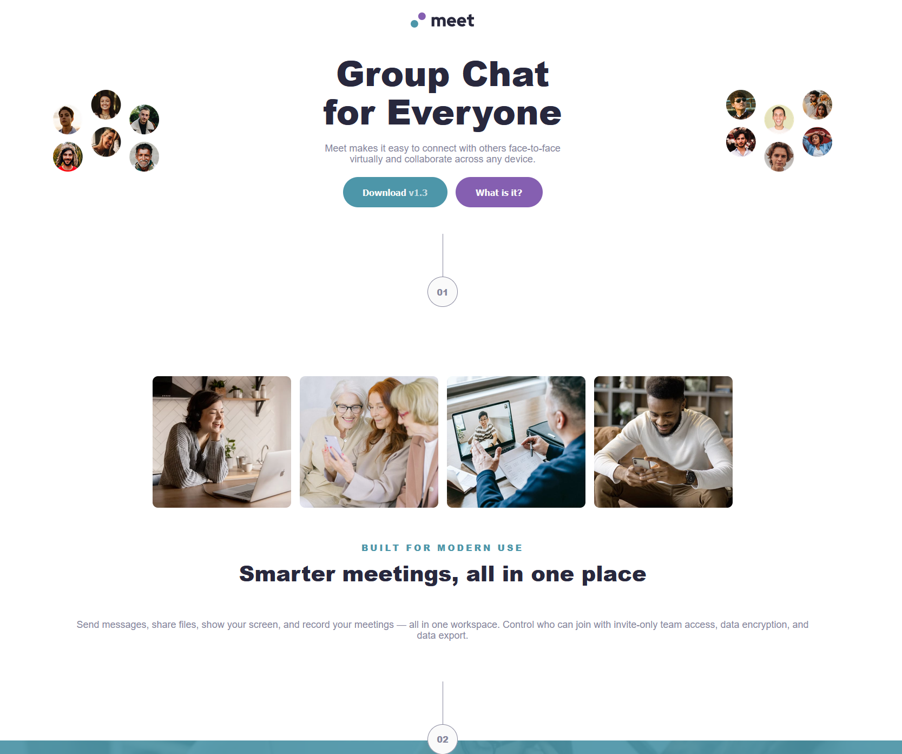
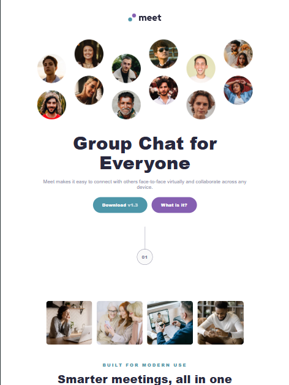
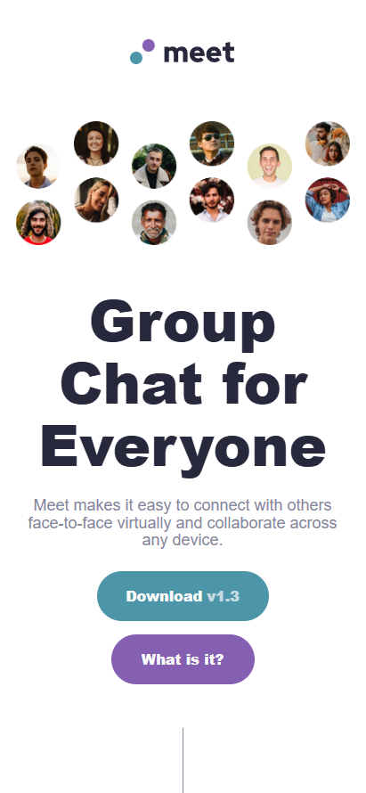

Frontend Mentor - Meet landing page solution

This is a solution to the [Meet landing page challenge on Frontend Mentor](https://www.frontendmentor.io/challenges/meet-landing-page-rbTDS6OUR). Frontend Mentor challenges help you improve your coding skills by building realistic projects.

## Table of contents

- [Overview](#overview)
  - [The challenge](#the-challenge)
  - [Screenshot](#screenshot)
  - [Links](#links)
- [My process](#my-process)
  - [Built with](#built-with)
  - [What I learned](#what-i-learned)
  - [Continued development](#continued-development)
  - [AI Collaboration](#ai-collaboration)

**Note: Delete this note and update the table of contents based on what sections you keep.**

## Overview

### The challenge

This HTML & CSS only challenge is perfect if you're starting to get a bit comfortable with my layout skills. The responsive layout shifts will also be a great test!

### Screenshot



*Desktop Screen*



*Tablet Screen*



*Phone Screen*

### Links

- Live Site URL: [Add live site URL here](https://your-live-site-url.com)

## My process

### Built with

- Semantic HTML5 markup
- CSS custom properties
- Flexbox
- CSS Grid
- Mobile-first workflow
- Sass
- Vite

### What I learned

In this project I made a focus on studying and applying Sass. Here is what I've learned:

1. SCSS Variables

```SCSS
$cyan-600: #4d96a9;
$cyan-300: #8fe3f9;
$purple-600: #855fb1;
$slate-900: #28283d;
$red-hat-display-black: "Red Hat Display", sans-serif;
```

2. SCSS Partials

```SCSS
@use './components/global';
@use './components/typography';
@use './components/section-borders';
@use './components/hero';
@use './components/btn';
@use './components/features';
@use './components/footer';
@use './components/tablet';
@use './components/desktop';
```

3. SCSS Maps - labeled collections of values

```SCSS
$text-presets: (
    "display": (font-size:6.4rem, line-height:110%, letter-spacing: 0rem, font-weight: 900, color:token.$slate-900),
    "heading": (font-size:4rem, line-height:110%, letter-spacing: 0rem, font-weight: 900, color:token.$slate-900),
    "eyebrow": (font-size:1.6rem, line-height:110%, letter-spacing: 0.4rem, font-weight: 900, color:token.$cyan-600, text-transform:uppercase),
    "body": (font-size:1.8rem, line-height:110%, letter-spacing: 0rem, font-weight: 500, color:token.$slate-600),
    "button": (font-size:1.6rem, line-height:150%, letter-spacing: 0rem, font-weight: 900, color:token.$primary-white),
);
```

4. @each loops - generating css from maps

```SCSS
@each $key, $val in $text-presets {
    .text-preset-#{$key} {
        @each $inner-key, $inner-val in $val {
            #{$inner-key}: $inner-val;
        }
    }
}
```

5. Interpolation #{}

```SCSS
.text-preset-#{$key} { ... }
```

6. Mixins (@mixin + @include) - reusable recipes with arguments

```SCSS
@mixin flex($direction: column, $align: center, $justify: center) {
    display: flex;
    flex-direction: $direction;
    align-items: $align;
    justify-content: $justify;
}

.flex-container {
    @include mixin.flex();   

.btn-container {
    @include mixin.flex($direction: row);   
}
```

### Continued development

I'll continue sharpen my skills in responsive design, sass and html.

### AI Collaboration

In this project I rely heavily on AI to explain me the concepts and provide best practices. However, I first watched a course on youtube about Sass by Net Ninja ([www.youtube.com/watch?v=_kqN4hl9bGc&amp;list=PL4cUxeGkcC9jxJX7vojNVK-o8ubDZEcNb](https://www.youtube.com/watch?v=_kqN4hl9bGc&list=PL4cUxeGkcC9jxJX7vojNVK-o8ubDZEcNb)) and only after I looked at the concepts I asked AI on how to properly implement them in my project.
